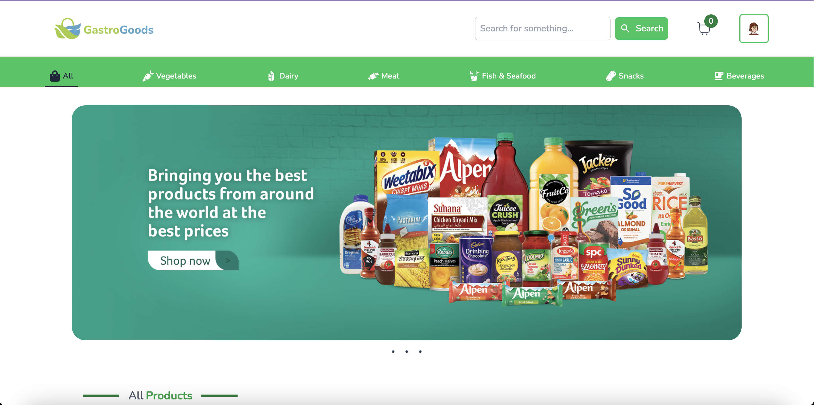
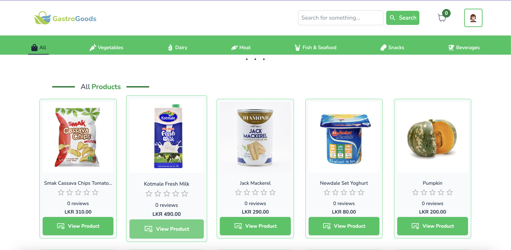
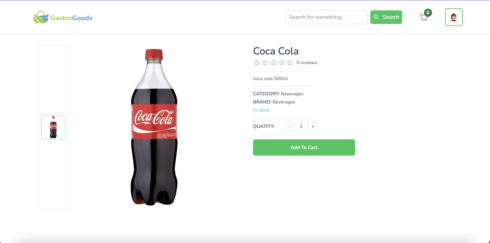
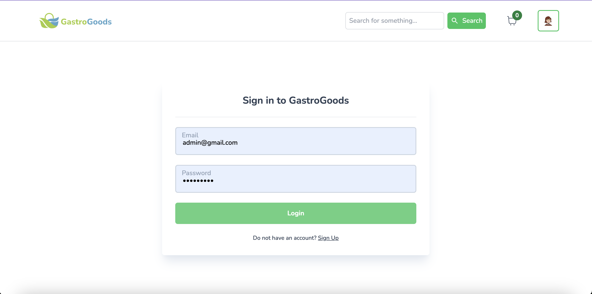
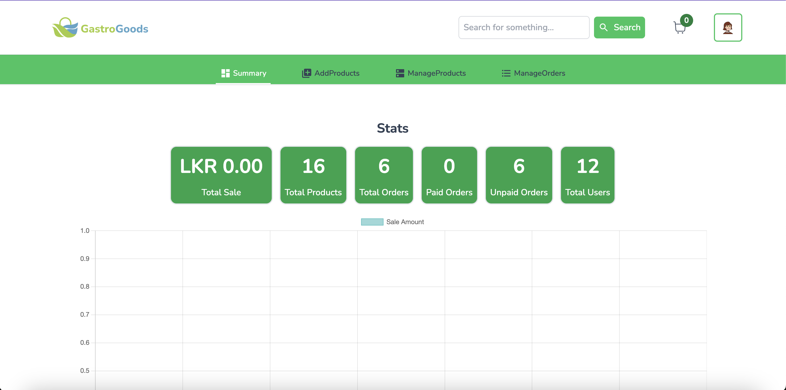
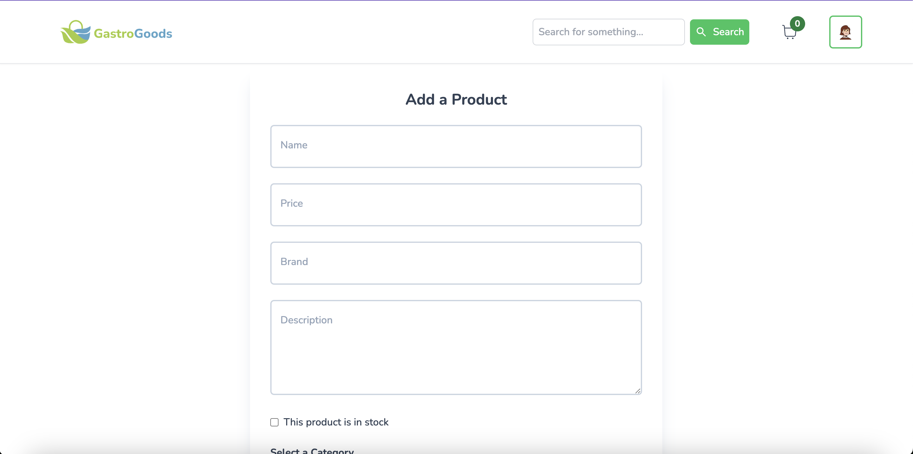
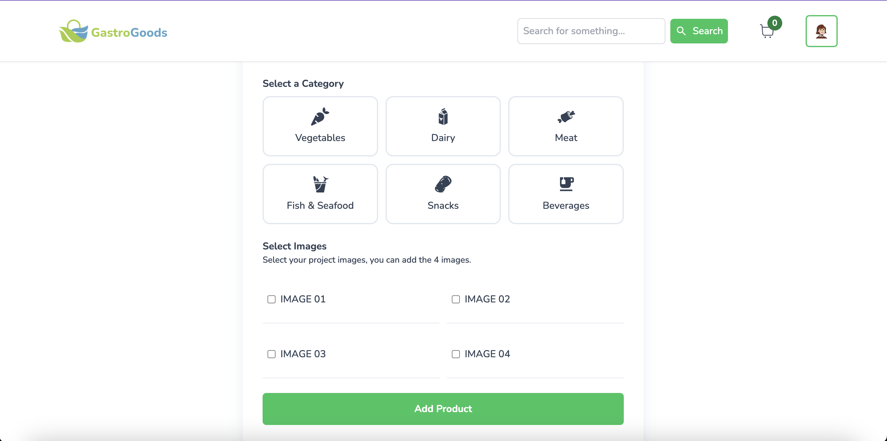
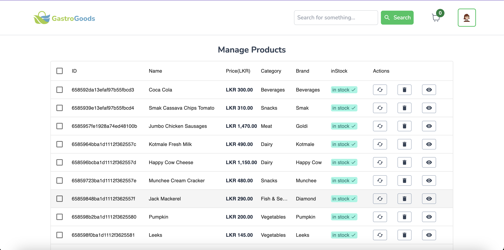
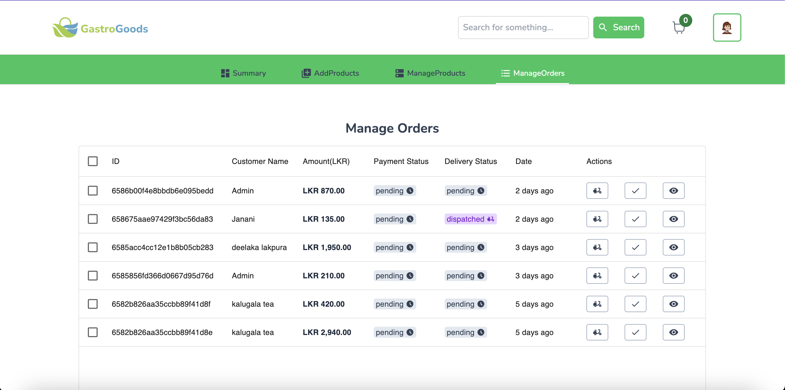
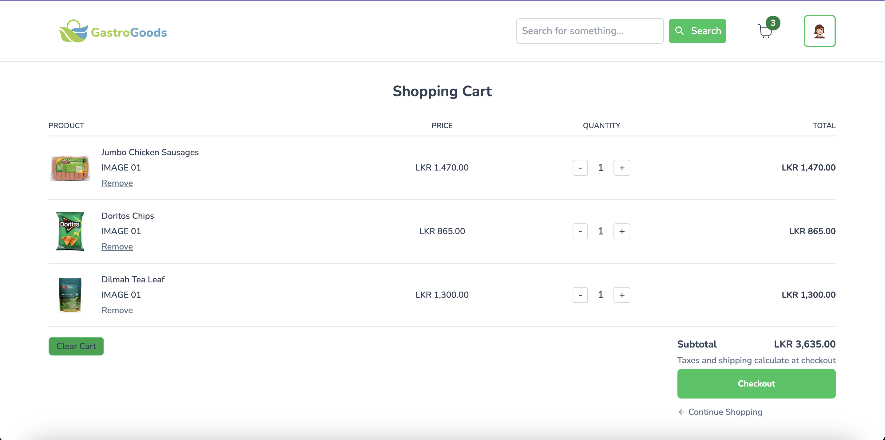

# GastroGoods E-Commerce Platform

Welcome to our GastroGoods e-commerce platform! This project utilizes Next.js for the frontend, Prisma for database management, MongoDB for data storage, Cloudinary for image storage, and NextAuth for authentication.


## Demo - <a href="https://gastrogoods.netlify.app/" target="_blank">Click Here!</a>
## Admin Demo - <a href="https://gastrogoods.netlify.app/admin" target="_blank">Click Here!</a>

## Features

- **Next.js:** The frontend is built using Next.js, a React framework that enables server-side rendering and other performance optimizations.

- **Prisma:** Prisma is used as the database toolkit to access and manage the MongoDB database.

- **MongoDB:** MongoDB is used as the primary database for storing product information and other relevant data.

- **Cloudinary:** Cloudinary is utilized for efficient and scalable image storage and management.

- **NextAuth:** NextAuth is integrated for user authentication, making it easy to implement secure user login and registration.

## Getting Started

### Prerequisites

- Node.js and npm installed
- MongoDB instance set up
- Cloudinary account for image storage

### Installation

1. **Clone the repository:**

   ```bash
   git clone https://github.com/DeelakaLakpura/GastroGoods.git

   cd GastroGoods
   npm install
   npm run dev


## screenshots -












Teasting
